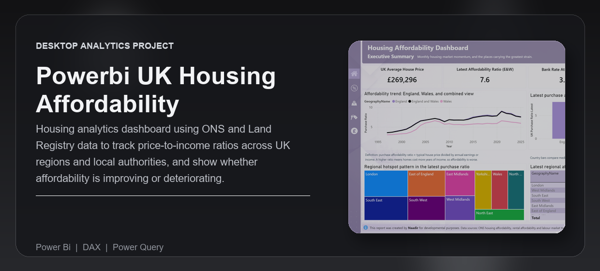
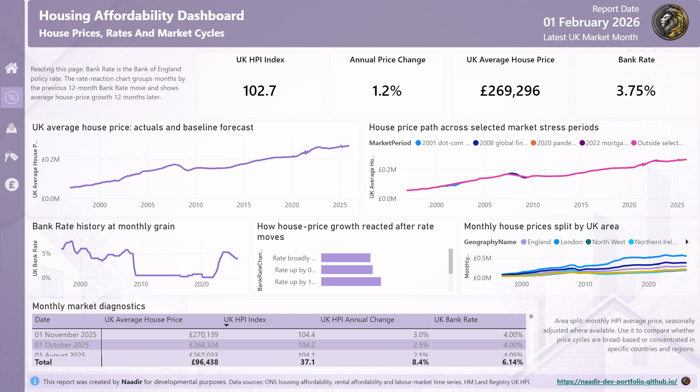
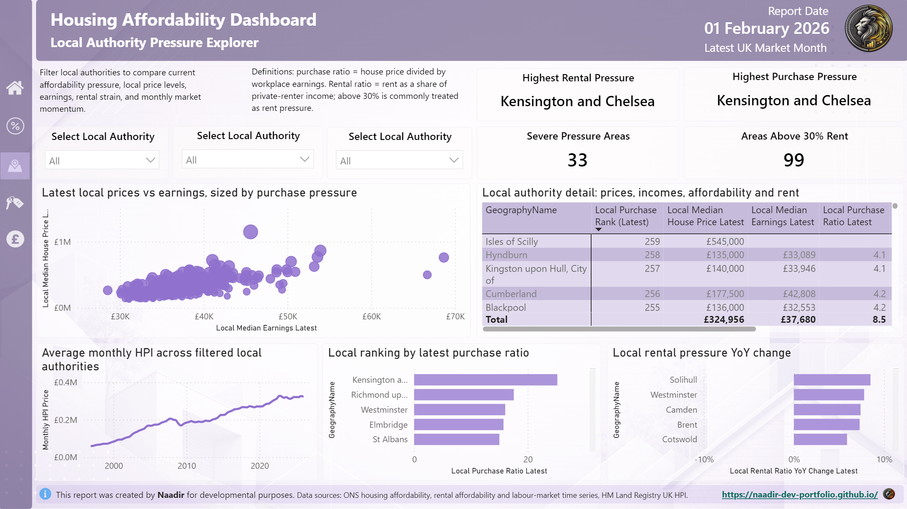
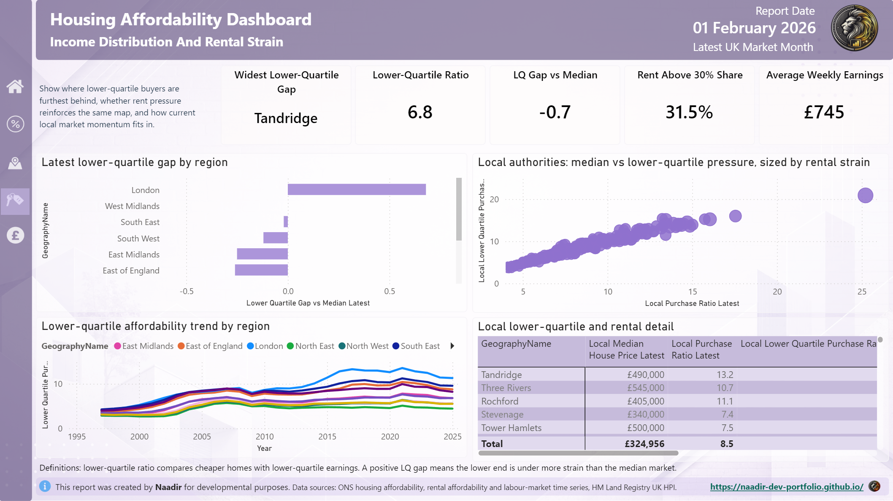

---

  

<strong>Power BI dashboard tracking UK housing affordability, house prices, wage pressure, Bank Rate changes, rents, and local authority strain across official public datasets.</strong>

Built for analysts, portfolio reviewers, and public-data users who need to understand where housing pressure is worsening, easing, or becoming structurally unaffordable.

<strong>Technical documentation:</strong> <a href="https://naadir-dev-portfolio.github.io/powerbi-uk-housing-affordability-dashboard/">View the published report documentation</a>

  <a href="#overview">Overview</a> |
  <a href="#what-problem-it-solves">What It Solves</a> |
  <a href="#feature-highlights">Features</a> |
  <a href="#screenshots">Screenshots</a> |
  <a href="#quick-start">Quick Start</a> |
  <a href="#tech-stack">Tech Stack</a>

<h3><strong>Made by Naadir | May 2026</strong></h3>

---

## Overview

This project is a Power BI housing-market analysis report focused on UK affordability pressure. It brings together house prices, price-to-income ratios, lower-quartile affordability, rents, Bank Rate history, wages, unemployment, and regional/local authority comparisons into one report.

The dashboard supports a clear workflow: start with the national affordability picture, move into house price and rate cycles, drill into local authority pressure, then test whether income, wages, rents, and unemployment reinforce the same story. It is designed to make the housing affordability problem understandable without needing to manually join ONS, Land Registry, and Bank of England datasets.

The practical outcome is a refreshable portfolio-grade report that shows where homes are least affordable, how house prices have moved over time, whether wage growth is keeping up, and which areas are under the greatest purchase or rental strain.

## What Problem It Solves

- Removes the need to manually compare housing, earnings, rent, wage, unemployment, and interest-rate datasets across separate public sources
- Replaces spreadsheet-heavy affordability checks with a refreshable Power BI semantic model and curated CSV layer
- Makes it clearer whether pressure is driven by house prices, weak earnings, rental strain, interest-rate conditions, or local market differences
- Gives a stronger view than a static affordability snapshot because it includes historical trends, local authority rankings, monthly HPI movement, and macro context

### At a glance

| Track | Analyse | Compare |
|---|---|---|
| UK house prices, affordability ratios, rents, wages, unemployment, and Bank Rate | Price-to-income pressure, lower-quartile strain, rent affordability, wage growth, and rate-cycle reactions | UK countries, English regions, Wales, and local authorities |
| ONS affordability and labour-market data, HM Land Registry UK HPI, Bank of England Bank Rate | Latest values, annual change, indexed trends, local rankings, and forecast-style baseline movement | House prices vs earnings, wages vs unemployment, Bank Rate moves vs later house-price growth |
| Refreshable public-source data pipeline | Power BI pages, DAX measures, trend charts, ranked tables, and diagnostic views | Median vs lower-quartile pressure, purchase vs rental strain, national vs local patterns |

## Feature Highlights

- **Executive Summary**, gives a fast read on latest house prices, affordability ratios, Bank Rate, severe-pressure areas, and regional hotspots
- **House Prices And Rate Cycles**, shows monthly UK HPI movement, market stress periods, Bank Rate history, and how house-price growth reacted after rate changes
- **Local Authority Explorer**, ranks local areas by purchase pressure and shows prices, earnings, rental strain, and local HPI movement
- **Income And Rental Strain**, compares median and lower-quartile affordability to show whether pressure is concentrated at the lower end of the market
- **Wages, Jobs And House Prices**, brings house prices, average weekly earnings, unemployment, and wage-adjusted affordability into one macro view
- **Refreshable data pipeline**, downloads and prepares public datasets into a clean curated layer for the Power BI model

### Core capabilities

| Area | What it gives you |
|---|---|
| **Affordability modelling** | Shows how many years of income are needed to buy typical homes, with higher ratios meaning worse affordability |
| **Local authority pressure analysis** | Identifies the places with the highest purchase and rental strain across England and Wales |
| **Monthly house-price tracking** | Uses UK HPI monthly data to show price direction, annual growth, stress periods, and regional splits |
| **Macro context** | Connects house prices with wages, unemployment, and Bank Rate changes so the report explains pressure rather than only showing it |

## Screenshots

<strong>Open screenshot gallery</strong>

 

  
    
  
    
  

## Quick Start

bash
# Clone the repo
git clone https://github.com/Naadir-Dev-Portfolio/powerbi-uk-housing-affordability-dashboard.git
cd powerbi-uk-housing-affordability-dashboard

# Install dependencies
pip install pandas numpy requests openpyxl

# Run
python "Source Data/scripts/download_uk_housing_affordability_data.py"
python "Source Data/scripts/prepare_housing_affordability_model_data.py"

Open `Housing Affordability Dashboard.pbip` in Power BI Desktop and refresh the model. No API keys are required; the project uses public, no-account data sources.

## Tech Stack

<strong>Open tech stack</strong>

 

| Category | Tools |
|---|---|
| **Primary stack** | DAX | Power Query |
| **UI / App layer** | Power BI Desktop | PBIP enhanced report format |
| **Data / Storage** | CSV | JSON | XLSX | PBIP/TMDL files |
| **Automation / Integration** | Python ingestion scripts | ONS public data | HM Land Registry UK HPI | Bank of England IADB |
| **Platform** | Windows | Power BI Desktop |

## Architecture & Data

<strong>Open architecture and data details</strong>

 

### Application model

The project starts with public data acquisition scripts that download official housing, rental, earnings, wage, unemployment, house-price, and Bank Rate data into `Source Data/raw`. A preparation script cleans and reshapes those files into curated CSV facts and dimensions for dates, geography, affordability, monthly HPI, Bank Rate, labour-market indicators, and macro indexed trends.

Power BI reads the curated layer through TMDL table definitions, relationships, and DAX measures. The report pages then use the semantic model to show national trends, local authority rankings, regional splits, rent and income strain, and macro context in a refreshable dashboard.

### Project structure

text
powerbi-uk-housing-affordability-dashboard/
+-- Housing Affordability Dashboard.pbip
+-- Housing Affordability Dashboard.Report/
+-- Housing Affordability Dashboard.SemanticModel/
+-- Source Data/
+-- README.md
+-- repo-card.png
+-- portfolio/
    +-- powerbi-uk-housing-affordability.json
    +-- powerbi-uk-housing-affordability.webp
    +-- Screen1.png
    +-- Screen2.png
    +-- Screen3.png

### Data / system notes

- Data is sourced from ONS housing affordability and labour-market time series, HM Land Registry UK HPI, and Bank of England Bank Rate data
- The model is local-first and does not require API keys or private credentials
- Refresh flow is script-based: run the download script, run the preparation script, then refresh the PBIP in Power BI Desktop

## Contact

Questions, feedback, or collaboration: naadir.dev.mail@gmail.com

DAX | Power Query

---
